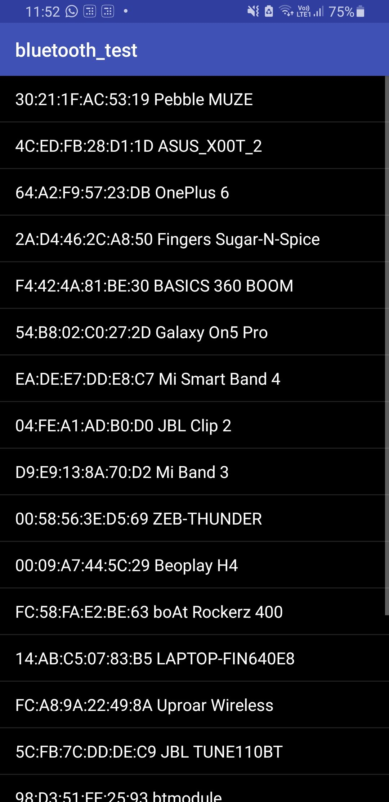
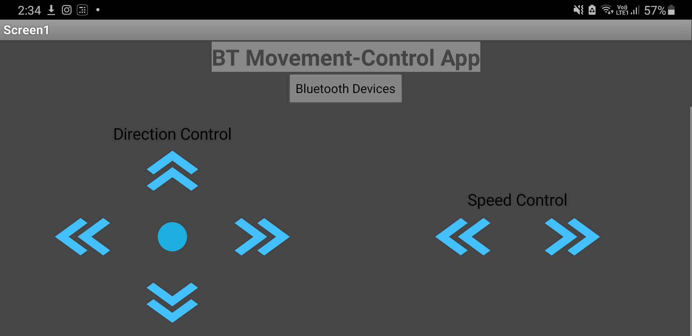
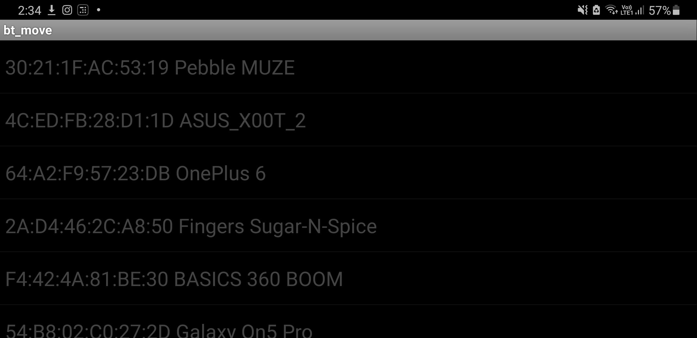
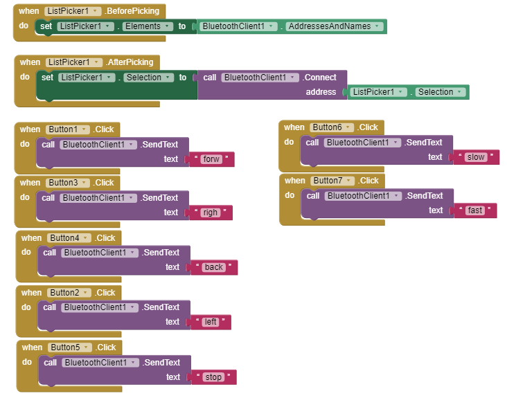

# Adnroid apps with MIT App Inventor

A collection of apps that I have made for specific purposes, using the MIT app inventor platform. 

1. BT_test:
    * This app was built as a starter app, to test/learn the functionalities of the app inventor.
    * A simple app that lets you connect to bluetooth devices and send text.
    * Pressing the ON button sends the text "ON" to the selected device.
    * Similarly for the OFF button.
    *  
  
2. BT_move:
    * This app was my first proper app using this platform.
    * A bluetooth app that lets you connect to bluetooth devices and send text.
    * Improved UI along with more functionality.
    * Allows for speed and direction control of mobile robots with a bluetooth module.
    *   